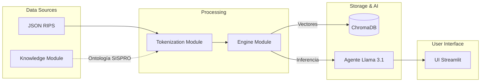

<div align="center">

🧬 CoMET-Col

Arquitectura Agéntica para Auditoría en Salud

Detección de Fugas Financieras por Fragmentación Clínica

</div>

🚧 1. El Dolor: La "Caja Negra" de la Fragmentación

En el modelo actual de pago por evento, las complicaciones derivadas de una atención deficiente se facturan como eventos nuevos e independientes.

🚨 El Problema: Una apendicectomía en la IPS A y una infección post-quirúrgica en la IPS B no se "hablan" administrativamente.

💸 El Impacto: El sistema paga doble: Paga por la cirugía inicial y paga por la complicación que debió prevenirse.

💡 2. La Solución: CoMET-Col

CoMET-Col (Colombia Medical Event Transformer) es un motor de auditoría predictiva basado en la metodología de Medical Tokenization (Epic Systems/Microsoft, 2025), adaptado a la ontología de FEV-RIPS y SISPRO.

🧠 Diferencial Tecnológico

A diferencia de los validadores de reglas estáticas (IF diagnosis == X), CoMET-Col utiliza Embeddings Semánticos para entender trayectorias clínicas.

Tokenización Semántica: Convierte JSON de RIPS en narrativas clínicas enriquecidas.

Vectorización: Entiende que [K358] seguido de [GAP_5_DIAS] y [T814] implica una causalidad clínica (fragmentación), no una coincidencia.

Agentes de IA: Utiliza LLMs (Llama 3.1) para razonar sobre la evidencia y estimar costos futuros.

🏗️ 3. Arquitectura Modular

El proyecto sigue una arquitectura limpia para separar la ontología médica de la lógica de inteligencia artificial.




📂 Estructura del Proyecto
``` text
plataforma_auditoria/
│
├── datos_rip/              # Simulación Data Warehouse (Tuva)
│   ├── historial_paciente.json
│   └── nuevo_evento.json
│
├── modules/                # Lógica de Negocio
│   ├── knowledge.py        # Ontología Estática (CIE-10, CUPS)
│   ├── repository.py       # Capa de Persistencia
│   ├── tokenization.py     # Algoritmo CoMET
│   └── engine.py           # Motor IA (Ollama + Chroma)
│
└── app.py                  # Orquestador UI (Streamlit)
```

🚀 4. Instalación y Uso

Este proyecto está diseñado para ejecutarse localmente garantizando la privacidad de los datos (Habeas Data).

Prerrequisitos

Anaconda (Python 3.10+)

Ollama instalado y ejecutándose.

Paso a paso

Clonar el repositorio:

``` bash
git clone [https://github.com/alonsov67/comet-col.git](https://github.com/alonsov67/comet-col.git)
cd comet-col


Preparar el entorno:

conda create -n salud_ai python=3.10
conda activate salud_ai
pip install -r requirements.txt


Descargar modelos de IA (Local):

ollama pull llama3.1
ollama pull nomic-embed-text


Ejecutar la Plataforma:
Asegúrate de tener ollama serve corriendo en otra terminal.

streamlit run app.py
```

🗺️ 5. Hoja de Ruta (Roadmap)

Fase

Estado

Descripción

Fase 1: Mockup Funcional

✅

Ejecución local con Llama 3.1, LangChain y RAG básico sobre JSON simulados.

Fase 2: Embeddings de Dominio

🚧

Entrenamiento de modelo específico con ontología colombiana completa (CIE-10 + CUPS + Manual Tarifario).

Fase 3: Despliegue Cloud

☁️

Migración a infraestructura segura (Azure/AWS) y conexión con APIs reales de interoperabilidad FHIR.

<div align="center">
<small>Desarrollado para la Unidad de innovación y Analitica Avanzada ADRES de Colombia.</small>
</div>